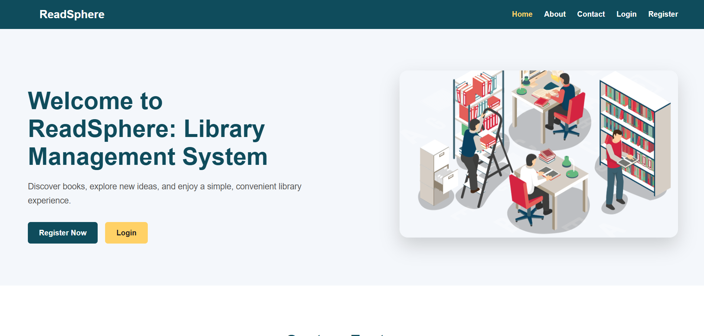
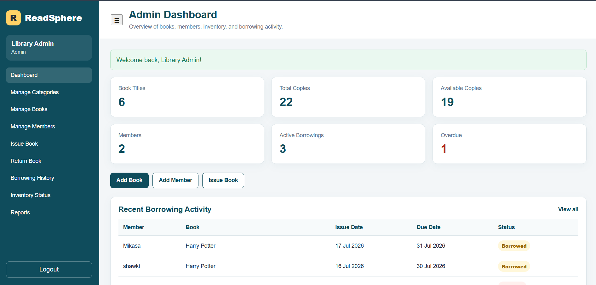
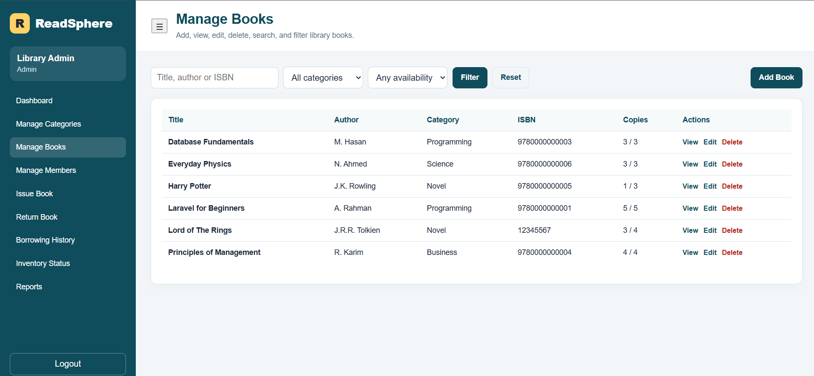
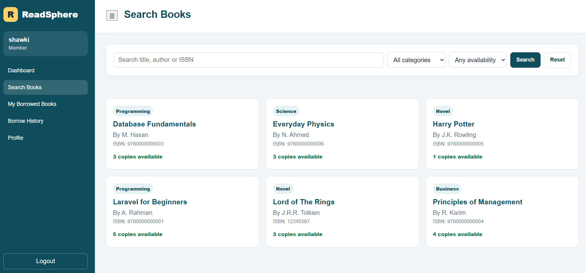
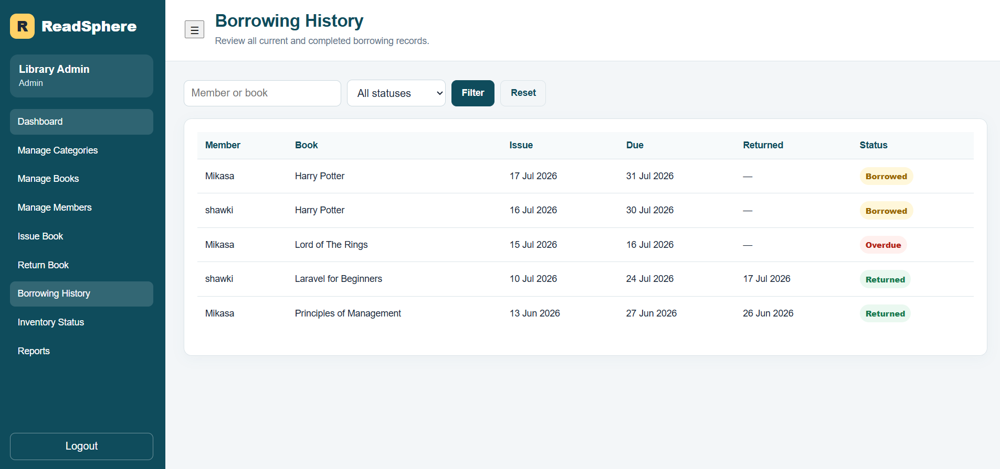
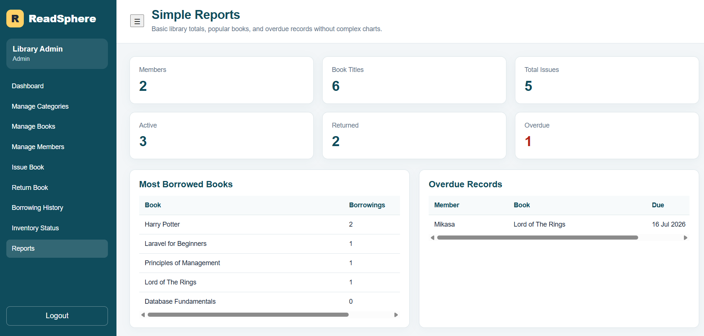

# ReadSphere — Library Management System

ReadSphere is a web-based library management system developed with **Laravel 12**, **PHP**, and **MySQL**. It provides a simple platform for managing books, categories, members, borrowing records, returns, inventory, overdue books, and library reports.

The system supports two user roles: **Admin** and **Member**.

---

## Features

### Admin Features

- View library statistics from the dashboard
- Manage book categories
- Add, edit, view, search, and delete books
- Manage library members
- Issue books to members
- Process book returns
- View and filter borrowing history
- Monitor book inventory and availability
- Identify overdue borrowing records
- View simple library reports

### Member Features

- Register and log in securely
- Search books by title, author, or ISBN
- Filter books by category and availability
- View currently borrowed books
- View complete borrowing history
- Identify overdue books
- Update profile information and password

### API Features

ReadSphere provides public JSON endpoints for books and categories:

| Method | Endpoint | Description |
|---|---|---|
| GET | `/api/books` | Retrieve books |
| GET | `/api/books/{book}` | Retrieve one book |
| GET | `/api/categories` | Retrieve categories |

Book API filters:

```text
/api/books?search=Laravel
/api/books?category_id=1
/api/books?availability=available
```

---

## Screenshots

### Home Page



### Admin Dashboard



### Book Management



### Member Book Search



### Borrowing History



### Reports



---

## Technologies Used

- Laravel 12
- PHP 8.2
- MySQL
- Blade Templates
- Eloquent ORM
- HTML5
- CSS3
- JavaScript
- JSON API
- XAMPP

---

## Installation

### 1. Clone the repository

```bash
git clone https://github.com/shawki2207112-blip/ReadSphere.git
cd ReadSphere
```

### 2. Install dependencies

```bash
composer install
```

### 3. Create the environment file

For Windows:

```bash
copy .env.example .env
```

For macOS or Linux:

```bash
cp .env.example .env
```

### 4. Generate the application key

```bash
php artisan key:generate
```

### 5. Configure the database

Create a MySQL database named:

```text
library_management
```

Update the database section in `.env`:

```env
DB_CONNECTION=mysql
DB_HOST=127.0.0.1
DB_PORT=3306
DB_DATABASE=library_management
DB_USERNAME=root
DB_PASSWORD=
```

### 6. Run migrations and seeders

```bash
php artisan migrate --seed
```

### 7. Clear cached configuration

```bash
php artisan optimize:clear
```

### 8. Start the application

```bash
php artisan serve
```

Open:

```text
http://127.0.0.1:8000
```

Make sure **MySQL is running in XAMPP** before using the application.

---

## Demo Accounts

| Role | Email | Password |
|---|---|---|
| Admin | `admin@library.com` | `admin123` |
| Member | `shawki@gmail.com` | `shawki123` |

> These accounts are intended only for local project demonstration.

---

## Main Project Structure

```text
app/Http/Controllers/Admin
app/Http/Controllers/Member
app/Http/Controllers/Api
app/Models
database/migrations
database/seeders
resources/views/admin
resources/views/member
resources/views/components
routes/web.php
routes/api.php
screenshots
```

---

## Borrowing Status Logic

Borrowing records use two main database statuses:

- `borrowed`
- `returned`

A record is displayed as **Overdue** when it is still borrowed and its due date has passed. The overdue condition is calculated dynamically without changing the original database status.

---

## API Testing

Display all API routes:

```bash
php artisan route:list --path=api
```

Example endpoint:

```text
http://127.0.0.1:8000/api/books
```

A successful request returns JSON similar to:

```json
{
    "success": true,
    "count": 6,
    "books": []
}
```

---

## Security Notes

- The `.env` file should never be uploaded to GitHub.
- Demo passwords should not be used in a real production system.
- Set `APP_DEBUG=false` before production deployment.
- Use strong and unique passwords for real accounts.

---

## Purpose

This project was developed as an academic laboratory project to demonstrate Laravel routing, authentication, role-based access, CRUD operations, database relationships, search and filtering, borrowing management, Blade templates, and JSON APIs.

---

## License

This project is created for educational purposes.
